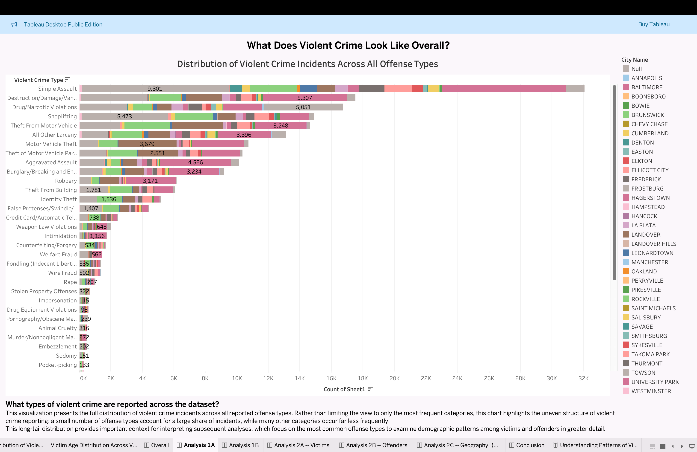
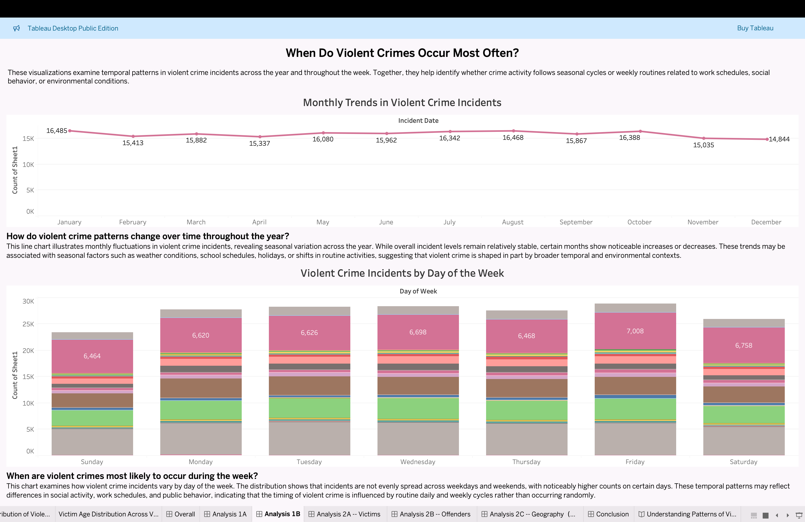
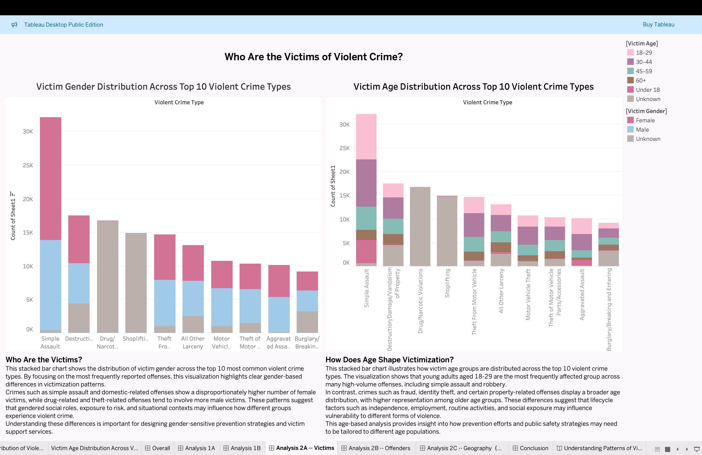
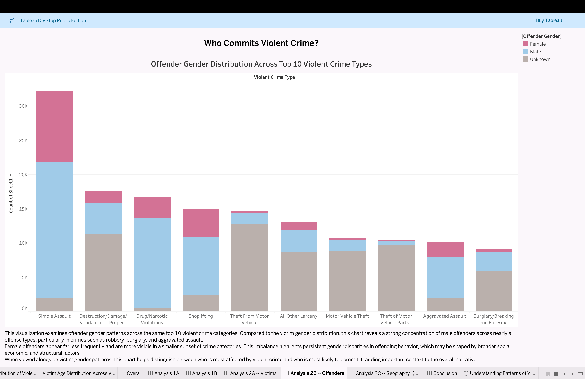
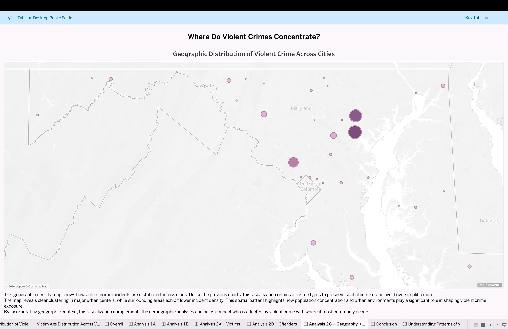

# Maryland Violent Crime Tableau Data Story

## Dashboard Preview
### Dashboard 1A

### Dashboard 1B

### Dashboard 2A

### Dashboard 2B

### Dashboard 2C

## Project Overview

This Tableau project explores patterns of violent crime across cities in Maryland using incident-level data from the FBI National Incident-Based Reporting System (NIBRS).

The goal of this project is to understand how violent crime varies by offense type, time, victim demographics, offender demographics, and geographic location. The final visualization is presented as a Tableau Story with multiple dashboards.

## Research Questions

1. Which types of violent crime occur most frequently?
2. How do violent crime patterns change over time?
3. Who is most affected by violent crime?
4. Where do violent crime incidents concentrate geographically?

## Files Included

- `Maryland Violent Crime.twbx`  
  Tableau packaged workbook containing the final dashboards and story.

- `Data.xlsx`  
  Data file used for the Tableau visualization.

- `Blog Post.pdf`  
  Written project report explaining the background, research questions, visualization design, findings, limitations, and next steps.

## Key Findings

- Violent crime incidents are not evenly distributed across offense types.
- Some crime categories account for a much larger share of incidents than others.
- Crime patterns show variation across months and days of the week.
- Victim and offender demographics reveal differences by age and gender.
- Violent crime incidents are geographically concentrated in major urban areas.

## Tools Used

- Tableau
- Microsoft Excel
- FBI NIBRS Crime Data

## Author
Xinyu(Katherine) Yuan
